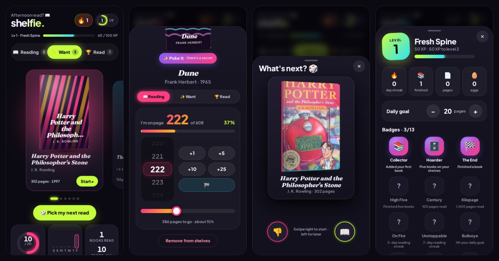

# Shelfie

**Your reading, levelled up.** Track what you're reading, what you've read and what you want to read next, in a dark, neon, very bouncy app made to give you a little hit of joy every time you turn a page.

No account, no ads, no build step. Everything lives on your own device.



---

## What it does

### Shelves
- Three shelves, **Reading**, **Want** and **Read**, behind a pill bar whose highlight stretches like taffy when you switch: the leading edge shoots ahead, the trailing edge catches up, then it squashes into place.
- Books sit on a swipeable **card carousel** that fans out in 3D. The middle card glows in its book's colours and its art comes alive.
- The **rightmost card is always a +** for adding another book.
- Real covers from Open Library, shown as a little **3D book** with a spine, page edges, a floor shadow and a shine that follows your finger. Books without a cover get **generated animated art** (orbs, rings, stripes, sunsets, waves, dot grids or sunbursts), picked from the title so the same book always looks the same.

### Logging pages
- Tap a book to open it. The cover flies from the card into the sheet.
- Set your page with a **scroll wheel** (an iOS-style drum with a tick on every page), a **slider** with a chunky thumb, or **+1 / +5 / +10 / +25** buttons. All three stay in sync.
- Or hit **+10** right on the carousel card.
- Reaching 25%, 50% and 75% pops a milestone. The last page (or the 🏁 button) finishes the book with a confetti storm and moves it to Read, where you rate it with bouncing stars.

### Dopamine
- **XP**: 1 per page, 20 for adding a book, 10 for starting one, 100 for finishing, 15 per easter egg, 10 for rating. Only pages beyond your furthest point count, so scrolling the wheel back and forth can't farm XP.
- **Levels**, from Fresh Spine to Literary Final Boss, with a ring on the level chip.
- **Daily goal** ring (20 pages by default, change it in your stats) and a 7-day bar chart.
- **Streaks** with a flickering flame.
- **13 badges**: Collector, Hoarder, The End, High Five, Century, Kilopage, On Fire, Unstoppable, Bullseye, Binge Reader, Night Owl, Egg Hunter, Egg Whisperer.
- **The island**: a black capsule at the top that stretches open from its middle (like the Dynamic Island) to show XP counting up, level-ups, badges and streaks, then pinches shut. It sits above open sheets too.

### Pick my next read
On the Want shelf, **🎲 Pick my next read** deals your pile as a Tinder-style stack. Drag right (READ NOW) to start it, left (LATER) to send it to the bottom. Cards lean as you drag, stamps fade in, and a fast flick counts even if it's short. Arrow keys work too.

### Easter eggs
Poke a book's cover (or the ✨ Poke it button). Some books have their own trick, matched on the title or author:

| Book | Trick |
|---|---|
| Harry Potter | Lumos: a lightning bolt and gold sparks |
| Dune | The spice must flow: sand, and a sandworm rumble |
| The Hobbit / Lord of the Rings | My precious: a golden ring, and the book turns invisible |
| 1984 | Big Brother is watching: an eye that looks around and blinks |
| The Great Gatsby | The green light, with champagne |
| Alice in Wonderland | Drink me: shrink, then grow |
| The Hitchhiker's Guide | 42, DON'T PANIC |
| Moby-Dick, the sea | A wave and a whale |
| Sherlock, Christie, mysteries | A magnifying glass sweeps the cover |
| Dragons, thrones, fire | Dracarys |
| Space, Mars, Project Hail Mary | Liftoff |
| Romance, Austen | Hearts |

Everything else cycles through party tricks: a kickflip, the cover opening to Chapter One, jelly mode, disco, boing. **Poke five times fast** for a supernova. Each egg pays XP once per book.

Two more are hidden in the app itself: tap the **logo five times**, and try the **Konami code** on a keyboard.

### Everywhere else
- Starter stack: one tap fills empty shelves with a few classics to play with.
- Back up and restore your shelves as a JSON file (in your stats).
- Add to home screen: opens full-screen like an app.
- Haptic ticks on phones that support them.
- Respects reduced motion: no confetti, no flying, everything still works.
- Keyboard and screen-reader friendly: the tabs are a tablist, the wheel is a spinbutton (arrows, Page Up/Down, Home/End), sheets are real dialogs (Escape closes them).

---

## How it's built

Plain HTML, CSS and native ES modules, served as static files (GitHub Pages works). The only network calls go to Open Library, for search and covers.

```
index.html            Shell, security policy, the home screen and the four sheets
styles.css            Tokens, the neon-on-dark look, the 3D book, every animation
manifest.webmanifest  Name, icons and full-screen mode for add to home screen
js/
  main.js             The screen: carousel, book sheet, search, picker, stats, secrets
  store.js            All data and rules: books, reading log, XP, levels, streaks, badges (no DOM)
  cover.js            The 3D book and the generated cover art
  island.js           The Dynamic-Island-style capsule and its message queue
  tabs.js             The stretchy shelf switcher
  wheel.js            The page scroll wheel
  swipe.js            The swipe deck for picking your next read
  eggs.js             Easter eggs
  confetti.js         Confetti, sparks and floating "+XP" on one canvas
  sheet.js            Bottom sheets on <dialog>, with drag to dismiss
  search.js           Open Library search
  util.js             Safe DOM builder, seeded random, motion helpers
tests/
  store.test.mjs      Unit tests for the rules (node --test)
  app.e2e.mjs         Browser tests for the whole app (Playwright, Open Library stubbed)
tools/build-icons.mjs Renders the app icons from one SVG mark
fonts/                Fraunces and Plus Jakarta Sans (self-hosted)
```

All page text goes through `textContent`, so a book title from a search can never become HTML. The only SVG parsed from strings is built from numbers and the app's own colours.

### Data

Saved in `localStorage` under `shelf.v1`:

```json
{
  "v": 1,
  "books": [{ "id": "…", "title": "Dune", "author": "Frank Herbert", "pages": 608, "page": 212, "best": 212,
              "shelf": "reading", "cover": 11481354, "rating": 0, "added": "ISO", "started": "ISO", "finished": null }],
  "log": { "2026-10-02": 34 },
  "xp": 540, "goal": 20, "badges": { "first-add": "ISO" }, "eggs": ["<bookId>:spice"]
}
```

`best` is the furthest page you've reached, which is what XP and the reading log count against.

---

## Running it

```sh
python3 -m http.server 8765   # then open http://localhost:8765
```

Any static server works. To publish, turn on GitHub Pages for the `main` branch (Settings → Pages → Deploy from a branch → `main`, `/ (root)`).

### Tests

```sh
npm test                                         # unit tests, no install needed
python3 -m http.server 8765 &                    # browser tests need the site running
NODE_PATH=$(npm root -g) node tests/app.e2e.mjs  # and Playwright installed globally
```

### Icons

```sh
NODE_PATH=$(npm root -g) node tools/build-icons.mjs
```

---

Book data and covers from [Open Library](https://openlibrary.org).
